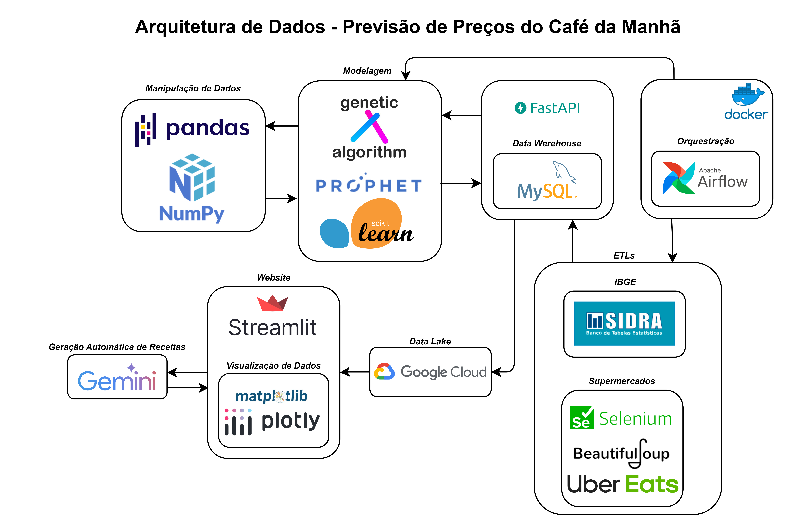

# 🥐 Previsão de Preços dos Itens do Café da Manhã

Projeto completo de engenharia e ciência de dados que coleta, processa, modela e disponibiliza informações sobre os preços de alimentos típicos do café da manhã brasileiro.

---

## 📌 Visão Geral

Este projeto foi desenvolvido com o objetivo de prever a variação de preços de alimentos com base em dados históricos do IBGE, supermercados e plataformas de delivery. Além disso, o sistema é capaz de sugerir receitas personalizadas de acordo com os ingredientes mais baratos no período.

---

## 🧱 Arquitetura



---

## 🔧 Tecnologias Utilizadas

### 📊 Coleta & ETL

- **IBGE/SIDRA API**
- **Selenium** + **BeautifulSoup** (Web scraping)
- **Apache Airflow** (Orquestração)
- **Docker** (Containerização)

### 🗃️ Armazenamento

- **MySQL** (Data Warehouse)
- **Google Cloud Storage** (Data Lake intermediário)

### 🧠 Modelagem

- **Facebook Prophet** (Séries temporais)
- **Algoritmos Genéticos** (Otimização de parâmetros)
- **Scikit-learn** (Avaliação e métricas)

### ⚙️ Backend

- **FastAPI** (API para servir dados e previsões)

### 📈 Visualização

- **Streamlit** (Interface Web)
- **Plotly**, **Matplotlib** (Gráficos interativos)

### 🤖 Extras

- **Google Gemini API** (Sugestões automáticas de receitas)
- **Jupyter Notebook** (Prototipagem)

---

## 🚀 Como Executar Localmente

1. Clone o repositório:

```bash
git clone https://github.com/lrs50/breakfast-forecast.git
cd breakfast-forecast
```
